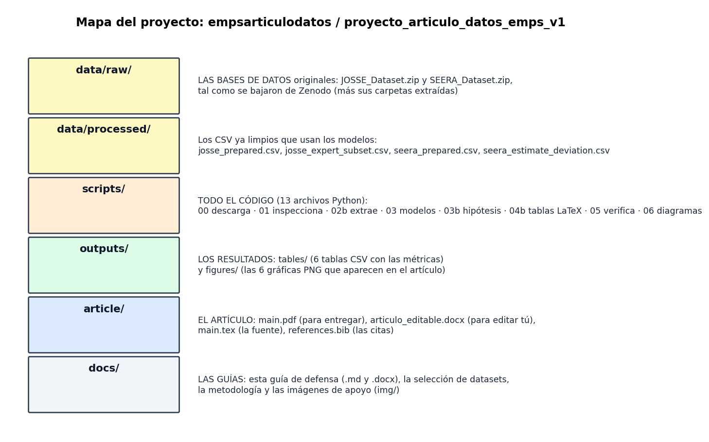
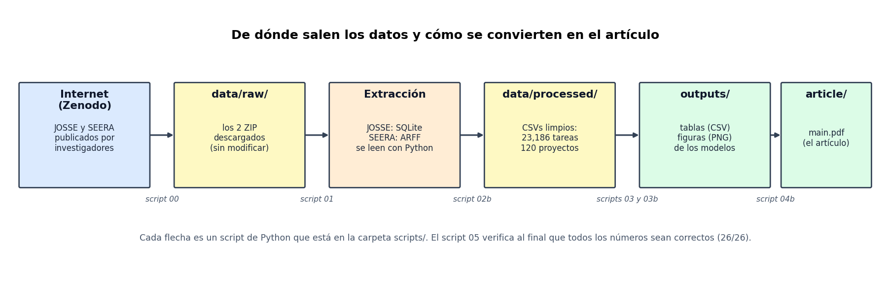
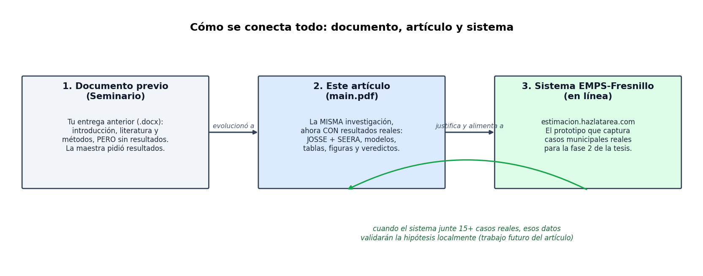

# Guía para entender y defender el artículo

Este documento es PARA TI, no para entregar. Explica en lenguaje sencillo dónde está cada cosa, cómo se obtuvieron los datos, qué significa cada número del artículo y cómo responder las preguntas más probables. Las imágenes de apoyo están en `docs/img/`.

---

## 1. La historia completa en 5 renglones

Tu sistema EMPS-Fresnillo ya existe, pero todavía no tiene suficientes proyectos reales terminados para validar tu hipótesis con datos locales. Entonces hiciste lo que hace cualquier investigador en esa situación: buscaste **bases de datos públicas** de proyectos de software reales, les aplicaste **análisis estadístico**, y usaste los resultados como **evidencia preliminar** de que tu hipótesis va por buen camino. El artículo presenta ese análisis. La validación con datos de Fresnillo queda como "trabajo futuro" (que es exactamente lo que tu prototipo va a recolectar).

---

## 2. Mapa: dónde está cada cosa



Todo vive en una sola carpeta: `empsarticulodatos/proyecto_articulo_datos_emps_v1/`. Así está organizada por dentro:

```
proyecto_articulo_datos_emps_v1/
├─ data/
│  ├─ raw/             LAS BASES DE DATOS originales, tal como se bajaron
│  │  ├─ JOSSE_Dataset.zip   (y su carpeta JOSSE_Dataset/ ya extraída)
│  │  └─ SEERA_Dataset.zip   (y su carpeta SEERA_Dataset/ ya extraída)
│  └─ processed/       los CSV ya limpios que usan los modelos
│     ├─ josse_prepared.csv           (23,186 tareas)
│     ├─ josse_expert_subset.csv      (4,329 tareas con estimación experta)
│     ├─ seera_prepared.csv           (120 proyectos, variables tempranas)
│     └─ seera_estimate_deviation.csv (estimado vs real por proyecto)
├─ scripts/            TODO EL CÓDIGO (13 archivos de Python)
├─ outputs/
│  ├─ tables/          los resultados en números (6 tablas CSV)
│  └─ figures/         las 6 gráficas que aparecen en el artículo (PNG)
├─ article/
│  ├─ main.pdf                EL ARTÍCULO terminado (esto es lo que se entrega)
│  ├─ articulo_editable.docx  el mismo artículo en Word, por si quieres editarlo
│  ├─ main.tex                la fuente del artículo (LaTeX)
│  ├─ references.bib          las 16 referencias
│  └─ generated/              tablas y cifras que el código le inserta al artículo
├─ docs/               las guías (esta) y las imágenes de apoyo (img/)
└─ README_EJECUCION.md los comandos exactos que se corrieron, en orden
```

### Si te preguntan algo, aquí está la respuesta

| Si te preguntan... | Está en... |
|---|---|
| ¿Dónde están las bases de datos? | `data/raw/` (los ZIP originales de Zenodo) y `data/processed/` (los CSV limpios) |
| ¿Dónde está el código? | `scripts/` (13 archivos de Python; abajo hay una tabla de qué hace cada uno) |
| ¿Dónde están los resultados? | `outputs/tables/` (números) y `outputs/figures/` (gráficas) |
| ¿Dónde está el artículo? | `article/main.pdf` (entregar) y `article/articulo_editable.docx` (editar) |
| ¿De dónde se descargaron los datos? | JOSSE: zenodo.org/records/7022735 · SEERA: zenodo.org/records/4066438 |
| ¿Cómo sé que los números están bien? | corre `scripts/05_verify_results.py`: recalcula todo y reporta 26/26 PASS |

---

## 3. Las dos bases de datos (apréndete esto)

### JOSSE (la principal)
- **Qué es**: 23,186 tareas reales de programación (issues de Jira) de 371 proyectos de código abierto (Apache, JBoss, Spring).
- **Qué trae cada tarea**: el texto de la solicitud (título + descripción), y las **horas reales** que tomó hacerla (registradas en los worklogs de Jira).
- **Lo especial**: 4,329 de esas tareas también tienen la **estimación que dio un experto ANTES de hacerlas**. Eso permite comparar "lo que el experto dijo" vs "lo que realmente tomó".
- **Quién la publicó**: Alhamed y Storer (2022), Universidad de Glasgow, en Zenodo.
- **Dónde está físicamente**: `data/raw/JOSSE_Dataset/`; el dato curado viene dentro del archivo `JOSSE_18092020.sqlite3`.
- **Por qué la elegiste**: es de las pocas bases públicas con esfuerzo real Y estimación experta por tarea. Tu hipótesis dice que estimar "a ojo" no basta, y esta base lo puede comprobar o refutar.

### SEERA (el contraste)
- **Qué es**: 120 proyectos completos de software de 42 organizaciones en entornos con **restricciones técnicas y económicas** (proyectos de Sudán, economías con limitaciones).
- **Qué trae**: 76 variables por proyecto, incluyendo esfuerzo **estimado al inicio** y esfuerzo **real al final**.
- **Dónde está físicamente**: `data/raw/SEERA_Dataset/`; el dato limpio viene en el archivo `.arff` principal.
- **Por qué la elegiste**: el contexto de restricciones económicas se parece más al de un proveedor municipal mexicano que los datos de Google o Microsoft. Y permite ver la desviación estimado-vs-real a nivel PROYECTO (no solo tarea).

---

## 4. Cómo se extrajeron los datos, paso a paso



La receta completa, en orden. Cada paso es un script que está en `scripts/`:

1. **Descarga (script 00)**. Baja los dos ZIP desde Zenodo (el sitio donde los autores publicaron oficialmente sus datos) y los guarda en `data/raw/` sin modificarlos.
2. **Inspección (script 01)**. Lista qué archivos vienen dentro de cada ZIP. Aquí se descubrió algo importante: el dato bueno de JOSSE NO está en los CSV crudos, sino en un archivo SQLite; y el dato bueno de SEERA NO está en los Excel (tienen encabezados rotos), sino en el archivo ARFF.
3. **Extracción y limpieza (script 02b)**. Es el corazón de la preparación:
   - **JOSSE**: abre `JOSSE_18092020.sqlite3` (una mini base de datos completa metida en un solo archivo) y lee su tabla `case`. Convierte el esfuerzo de segundos a horas (dividir entre 3,600), descarta tareas sin esfuerzo válido y separa en un CSV aparte las 4,329 tareas que sí traen estimación experta (en la base, las que no la tienen vienen marcadas con -1).
   - **SEERA**: abre el archivo `.arff` (un formato de texto típico de investigación, parecido a un CSV pero con un encabezado especial que describe cada columna). Conserva solo las 21 variables que se conocen AL INICIO del proyecto y excluye a propósito las que se conocen hasta el final (duración real, costos incurridos), para no hacer trampa con fuga de datos.
   - Resultado: los 4 CSV limpios de `data/processed/`.
4. **Modelos (script 03)**. Lee los CSV limpios y entrena tres modelos (línea base, regresión lineal, bosque aleatorio) con partición 75/25. Guarda las métricas en `outputs/tables/model_metrics.csv` y las gráficas en `outputs/figures/`.
5. **Hipótesis (script 03b)**. Calcula la precisión de los expertos (H1a), la desviación de SEERA (H1b) y la prueba de los términos de cambio (H2, Mann-Whitney). Guarda sus tablas y figuras.
6. **Tablas del artículo (script 04b)**. Convierte los resultados en tablas LaTeX en español y en "cifras" (macros) que el artículo inserta automáticamente. Ningún número del PDF se transcribió a mano.
7. **Verificación (script 05)**. Vuelve a calcular TODO desde cero, con código independiente del pipeline, y compara contra las tablas y contra los números citados en el texto: 26 de 26 verificaciones correctas.

### Qué hace cada archivo de código

| Script | Qué hace | Qué produce |
|---|---|---|
| `00_download_datasets.py` | descarga los 2 ZIP de Zenodo | `data/raw/` |
| `01_discover_datasets.py` | inspecciona qué hay dentro de cada ZIP | reporte en pantalla |
| `02_prepare_datasets.py` | primer intento genérico; no se usó (elegía archivos equivocados) | nada (referencia) |
| `02b_prepare_from_real_formats.py` | **el bueno**: lee el SQLite de JOSSE y el ARFF de SEERA, limpia y filtra | los 4 CSV de `data/processed/` |
| `03_run_analysis.py` | entrena línea base, regresión lineal y bosque aleatorio | `model_metrics.csv` + 3 figuras |
| `03b_run_hypothesis_analysis.py` | mide H1 (experto vs real, desviación SEERA) y H2 (Mann-Whitney) | 4 tablas + 3 figuras |
| `04_generate_article_assets.py` | primer intento genérico; no se usó (rompía el LaTeX) | nada (referencia) |
| `04b_generate_custom_assets.py` | **el bueno**: genera tablas LaTeX en español y las cifras del artículo | `article/generated/` |
| `05_verify_results.py` | recalcula desde cero los 26 números del artículo y compara | reporte 26/26 PASS |
| `06_generate_guide_diagrams.py` | genera las 3 imágenes de esta guía | `docs/img/` |
| `common.py` | funciones compartidas (métricas, guardado de tablas) | lo usan los demás |
| `inspect_josse_sample.py` y `inspect_josse_sqlite.py` | exploraciones rápidas para entender JOSSE | reporte en pantalla |

---

## 5. Los 3 resultados del artículo, explicados como para un amigo

### Resultado 1: "Los expertos ordenan bien pero le atinan mal" (H1)
- En JOSSE, la correlación entre lo que el experto estimó y lo real es alta (ρ = 0.79). O sea: el experto SÍ sabe distinguir cuál tarea es grande y cuál chica.
- PERO la magnitud falla: **solo el 39.8% de las estimaciones cayó dentro de ±15% del valor real**. Y el error mediano fue 33%.
- En español: si le pides a un experto que estime 10 tareas, en 6 de ellas se equivoca por más del 15%.

### Resultado 2: "En entornos pobres, TODOS subestiman" (H1, el dato estrella)
- En SEERA, el **80.8% de los proyectos costó MÁS esfuerzo del estimado**.
- La desviación mediana fue **+58.6%**: el proyecto típico costó casi 60% más de lo prometido.
- Solo el 16.7% de los proyectos quedó dentro de ±15%.
- En español: si un ayuntamiento acepta una cotización "a ojo", 8 de cada 10 veces el proyecto va a costar más (y típicamente 60% más). ESTE es el argumento de por qué Fresnillo necesita estimación seria.

### Resultado 3: "Las variables tempranas SÍ predicen" (H3)
- Con solo el TEXTO de la solicitud (longitud, palabras, proyecto), una regresión lineal explica el 39% de la variación del esfuerzo en JOSSE (R² = 0.39). La línea base (adivinar el promedio) explica 0%.
- Con las características del proyecto conocidas AL INICIO (tamaño estimado, equipo, tipo de organización...), un bosque aleatorio explica el 81% en SEERA (R² = 0.81).
- En español: capturar datos estructurados desde el inicio (que es exactamente lo que hace tu sistema EMPS) tiene valor real para predecir.

### Resultado "bonus": el resultado NULO de H2 (esto es ORO académico)
- Probaste si las tareas con palabras tipo "change/fix/bug" tienen esfuerzo distinto. Resultado: NO (p = 0.57, no significativo).
- ¿Eso es malo? NO. Es un resultado honesto que además **justifica tu diseño**: detectar cambios por palabras clave NO funciona, por eso EMPS-Fresnillo captura los cambios de forma ESTRUCTURADA (tipo, fase, artefactos afectados) y no adivinándolos del texto.
- Si te preguntan "¿y salió todo como esperabas?": "No, la H2 no se confirmó, y eso refinó el diseño del prototipo. Reportarlo es parte de la honestidad metodológica."

---

## 6. Cómo se conecta todo: documento previo, artículo y sistema



- **Tu documento previo de seminario** tenía introducción, revisión de literatura y metodología, pero NO tenía resultados. Esa fue la observación de la maestra.
- **Este artículo es la MISMA investigación** (misma hipótesis, mismo título sobre estimación temprana con control de cambios y referencia a Fresnillo), pero ahora completa: con datos reales, modelos entrenados, tablas, figuras, discusión y conclusiones. No es un trabajo nuevo; es el anterior ya terminado.
- **El sistema EMPS-Fresnillo** (estimacion.hazlatarea.com) es el prototipo que el propio artículo declara en su sección "Conclusiones y trabajo futuro" como el instrumento de la siguiente fase: capturar casos municipales reales de Fresnillo.
- **El ciclo se cierra así**: cuando el sistema junte al menos 15 casos reales terminados, vas a calcular con datos locales LAS MISMAS métricas de este artículo (MdMRE, PRED(15)). El panel `/investigacion/validacion-hipotesis` del sistema ya las calcula solo. Eso será la validación local que el artículo promete.
- La hipótesis del artículo ES tu hipótesis de tesis (estimación integral estructurada supera a estimar solo horas "a ojo"), bajada a lo que se puede probar hoy con datos públicos.
- El resultado nulo de H2 explica una decisión de diseño real de tu sistema: el módulo de control de cambios captura tipo, fase y artefactos en formularios estructurados, no analiza texto libre.

---

## 7. Conceptos que pueden preguntarte (en simple)

| Concepto | Qué es en simple |
|---|---|
| **Regresión lineal** | Trazar la "mejor línea recta" que relaciona variables (ej. más palabras en la solicitud, más horas). Es explicable: puedes ver cuánto pesa cada variable. |
| **Bosque aleatorio (random forest)** | Muchos "árboles de decisión" que votan. Captura relaciones no lineales. Es la comparación "más potente pero menos explicable". |
| **Línea base (baseline)** | El modelo más simple posible: siempre predecir el promedio. Si tu modelo no le gana, no sirve. |
| **R²** | Qué porcentaje de la variación explica el modelo. R²=0.39 explica el 39%. R²=0 no explica nada. Negativo: peor que adivinar el promedio. |
| **MAE / RMSE** | Errores promedio de predicción. Más chico = mejor. En el artículo están en escala logarítmica. |
| **MRE / MMRE / MdMRE** | Error relativo de una estimación: el estimado menos el real, dividido entre el real, en valor absoluto. MMRE es el promedio, MdMRE la mediana (más robusta a valores extremos). |
| **PRED(15)** | Porcentaje de estimaciones que cayeron dentro de ±15% del valor real. Es el estándar de "precisión aceptable" en medición funcional (IFPUG). |
| **log(1+esfuerzo)** | Transformación para que los proyectos gigantes no dominen el análisis. Práctica estándar con datos de "cola larga". |
| **Mann-Whitney** | Prueba estadística para comparar dos grupos sin asumir distribución normal. p < 0.05 = diferencia real; p = 0.57 = no hay evidencia de diferencia. |
| **Partición 75/25** | El modelo se entrena con 75% de los datos y se evalúa con el 25% que NUNCA vio. Así se evita hacer trampa. |
| **Fuga de datos (leakage)** | Usar como predictor algo que solo se conoce DESPUÉS (ej. la duración real). En SEERA excluimos esas variables a propósito; puedes presumir esto si te preguntan de rigor. |
| **SQLite** | Una base de datos completa guardada en un solo archivo. JOSSE entrega así sus datos curados; se lee con Python sin instalar nada. |
| **ARFF** | Formato de texto usado en investigación: como un CSV pero con un encabezado que describe cada columna. SEERA entrega así sus datos limpios. |

---

## 8. Preguntas probables + respuestas

**P: ¿Con qué bases de datos trabajaste?**
R: JOSSE como principal (23,186 tareas con esfuerzo real, 4,329 con estimación experta, de Zenodo, Alhamed y Storer 2022) y SEERA como contraste (120 proyectos en entornos restringidos, Mustafa y Osman 2020). Las dos están citadas con DOI en las referencias.

**P: ¿Dónde están esas bases de datos? ¿Las puedo ver?**
R: Sí. Los archivos originales, tal como se descargaron de Zenodo, están en la carpeta `data/raw/` del proyecto, y los datos ya limpios en `data/processed/`. También se pueden volver a descargar de Zenodo con el script `00_download_datasets.py`; las URLs públicas son zenodo.org/records/7022735 y zenodo.org/records/4066438.

**P: ¿Dónde está el código?**
R: En la carpeta `scripts/` del proyecto: 13 archivos de Python, uno por paso. El 00 descarga los datos, el 02b los limpia, el 03 entrena los modelos, el 03b prueba las hipótesis, el 04b genera las tablas del artículo y el 05 verifica todos los números. Se puede correr en vivo de principio a fin.

**P: ¿Cómo extrajiste los datos?**
R: Con scripts de Python. Descargué los ZIP oficiales de Zenodo; JOSSE trae sus datos curados en un archivo SQLite y SEERA en un archivo ARFF. Un script los abre, convierte el esfuerzo a horas, filtra registros inválidos y excluye las variables que se conocen hasta el final del proyecto, para evitar fuga de datos. De ahí salen CSV limpios y sobre esos corren los modelos.

**P: ¿Dónde está el machine learning?**
R: En la sección 4.2 del artículo: comparé línea base, regresión lineal y bosque aleatorio con scikit-learn, partición 75/25, métricas MAE/RMSE/R². Elegí modelos explicables a propósito: para un avance preliminar importa más entender qué variables pesan que maximizar la precisión.

**P: ¿Qué tiene que ver esto con Fresnillo?**
R: Tres cosas. Primero, demuestra que estimar "a ojo" falla (60 a 83% fuera del umbral), que es como se cotizan hoy los proyectos municipales. Segundo, demuestra que capturar variables estructuradas al inicio predice (R² hasta 0.81), que es lo que hace mi prototipo. Tercero, el contexto de SEERA (restricciones económicas) es el más parecido al de proveedores municipales mexicanos entre las bases públicas disponibles.

**P: ¿Por qué no usaste datos de Fresnillo directamente?**
R: Porque no existe un historial público de proyectos de software municipales con esfuerzo estimado y real. Eso es precisamente la brecha que mi prototipo ataca: es el instrumento de captura para construir ese dataset local. Este artículo es la fase preliminar con datos públicos; la validación local es la siguiente fase.

**P: ¿Qué pasó con la hipótesis de los cambios (H2)?**
R: No se confirmó con el método de palabras clave (p=0.57). Lo reporto como resultado nulo porque es informativo: la detección léxica no discrimina, lo que justifica que el prototipo capture los cambios de forma estructurada en lugar de inferirlos del texto.

**P: ¿Esto lo hiciste tú o el sistema?**
R: El pipeline es reproducible: scripts de Python que descargan los datos de Zenodo, los preparan, corren los modelos y generan las tablas y figuras del artículo automáticamente. Cualquiera puede repetir el análisis con los mismos scripts (están en la carpeta `scripts/` del proyecto). Los números del PDF salen de los CSV generados, sin transcripción manual.

**P: ¿Por qué el R² de SEERA (0.81) es tan alto comparado con JOSSE (0.39)?**
R: SEERA predice a nivel PROYECTO con 21 variables ricas (tamaño estimado, equipo, organización); JOSSE predice a nivel TAREA solo con el texto de la solicitud. Más información estructurada da mejor predicción. Además SEERA es pequeño (30 casos de prueba) así que su R² se reporta con cautela; está dicho en "Amenazas a la validez".

**P: ¿Cómo sé que tus números están bien?**
R: Hay un script de verificación independiente (`scripts/05_verify_results.py`) que recalcula desde cero cada número que aparece en el artículo, con código distinto al del análisis, y los compara. Las 26 verificaciones pasan. Se puede correr en vivo.

---

## 9. Cómo regenerar todo (si te piden demostrarlo en vivo)

```powershell
cd empsarticulodatos\proyecto_articulo_datos_emps_v1
.venv\Scripts\python scripts\00_download_datasets.py           # descarga de Zenodo
.venv\Scripts\python scripts\02b_prepare_from_real_formats.py  # SQLite + ARFF -> CSV
.venv\Scripts\python scripts\03_run_analysis.py                # modelos + métricas
.venv\Scripts\python scripts\03b_run_hypothesis_analysis.py    # H1/H2
.venv\Scripts\python scripts\04b_generate_custom_assets.py     # tablas/figuras LaTeX
.venv\Scripts\python scripts\05_verify_results.py              # verificación 26/26
cd article
..\.tools\tectonic.exe main.tex                                # compila el PDF
```

El PDF queda en `article/main.pdf`. Las tablas en `outputs/tables/`, las figuras en `outputs/figures/`.

---

## 10. Los números que tienes que saberte de memoria

| Número | Qué es |
|---|---|
| **23,186** | tareas de JOSSE |
| **4,329** | tareas con estimación experta |
| **120** | proyectos de SEERA |
| **39.8%** | PRED(15) de los expertos: solo 4 de 10 le atinan a ±15% |
| **80.8%** | proyectos de SEERA subestimados |
| **+58.6%** | desviación mediana del esfuerzo en SEERA |
| **0.39** | R² de la regresión lineal en JOSSE (variables de texto) |
| **0.81** | R² del bosque aleatorio en SEERA (variables tempranas) |
| **p = 0.57** | la prueba de H2: sin diferencia significativa (resultado nulo honesto) |
| **26/26** | verificaciones independientes que pasan en el script 05 |
