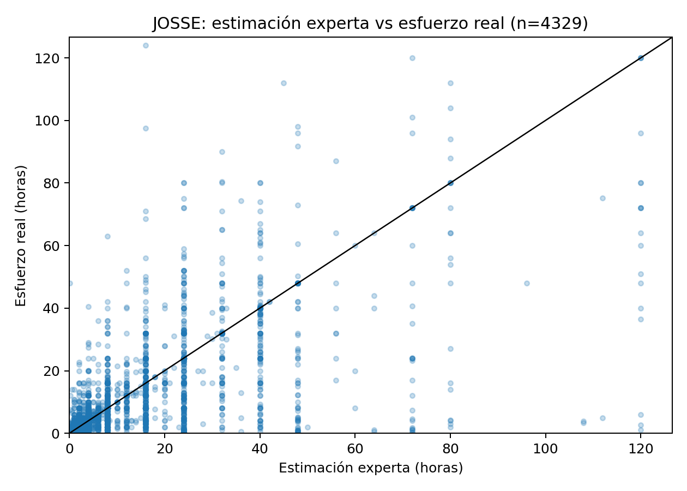
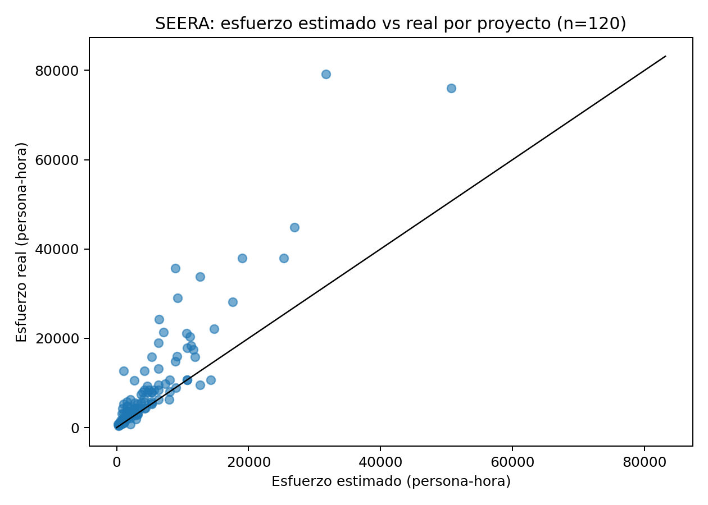
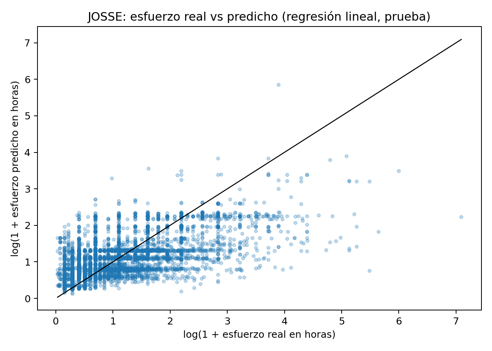
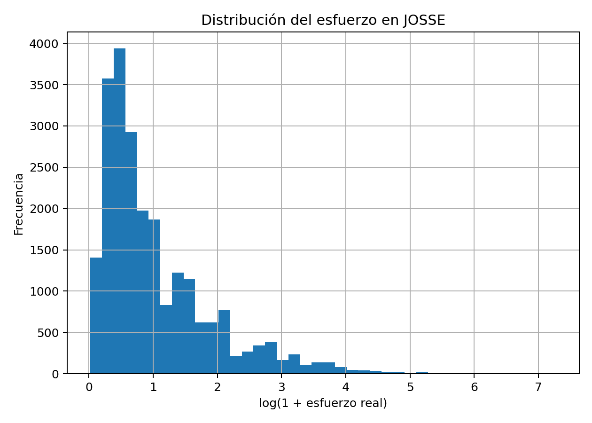
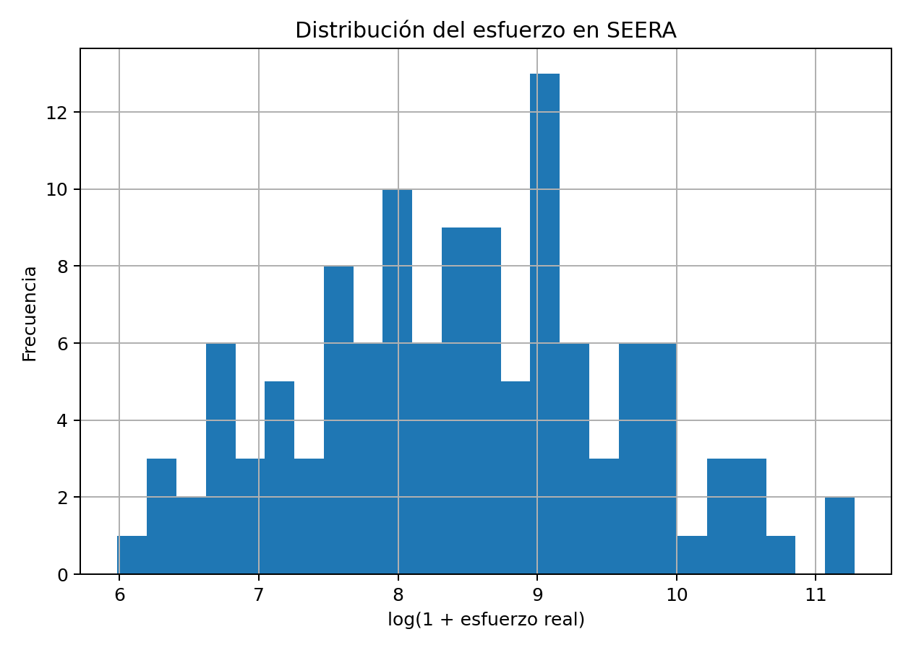
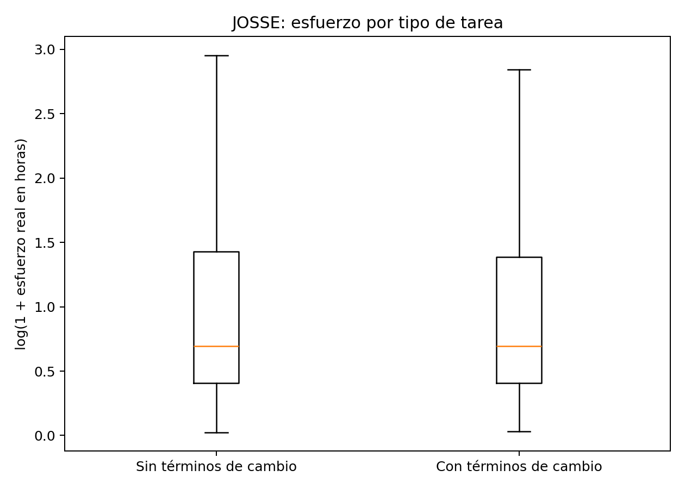

# Guion de exposición: el artículo en 5 minutos

Este documento es PARA TI. La parte marcada como GUION se dice tal cual, palabra por palabra; lo demás es apoyo por si preguntan. Lo que va entre corchetes, como `[PÁG 3]`, NO se lee: es para que sepas en qué página del PDF poner el dedo.

---

## Antes de empezar: 3 cosas que no se te pueden olvidar

1. **Tú NO recolectaste los datos.** Son dos bases públicas que otros investigadores publicaron. Lo tuyo fue analizarlas. Si dices "yo hice los datasets" te metes en un problema gratis.
2. **No revuelvas las dos bases.** Truco: **J**OSSE = **J**ira = miles de tareas chiquitas (23,186). SEERA = proyectos enteros y son pocos (120).
3. **Frase salvavidas** si te preguntan algo que no sabes: *"Eso lo dejé fuera del alcance de esta fase, profesora; lo retomo en la validación con datos locales."* Dicha con calma, cierra casi cualquier tema.

---

## EL GUION (esto se dice tal cual, ~5 minutos)

### Minuto 1: el tema y por qué lo elegí `[PÁG 1: título y resumen]`

Mi artículo es sobre cómo calcular desde el principio cuánto va a costar y cuánto va a tardar un sistema de software para un gobierno municipal, pensando en Fresnillo. Elegí este tema porque hoy esos proyectos se cotizan a ojo: alguien con experiencia dice "esto sale en tanto y en tantos meses", y con eso se firma. Y cuando el proyecto crece o cambia a la mitad, nadie tiene con qué medir el golpe. Yo estoy construyendo un sistema para resolver eso, así que primero necesitaba comprobar con datos reales que el problema existe y que sí se puede hacer mejor.

**Transición:** *"Pero para no quedarme en pura opinión, busqué datos reales de proyectos de otros lados. Esa es la parte de materiales y métodos."*

### Minuto 2: los datos que usé `[PÁG 2: sección 3]`

Usé dos bases de datos públicas que están en un sitio que se llama Zenodo, donde los investigadores publican sus datos; los enlaces vienen en mis referencias `[PÁG 6]`. La primera se llama JOSSE: son veintitrés mil tareas reales de programación de proyectos grandes de código abierto, como Apache. Lo valioso es que cuatro mil trescientas de esas tareas traen apuntado cuánto creyó el propio equipo que iba a tardar antes de hacerla, y cuántas horas tomó de verdad. La segunda se llama SEERA: ciento veinte proyectos completos hechos en entornos con pocos recursos, que se parecen más a la realidad de un proveedor municipal mexicano que a Silicon Valley.

**Transición:** *"Con esos datos me hice tres preguntas, que en el artículo son las tres hipótesis."* `[PÁG 3: sección 3.4]`

### Minuto 2 y medio: las tres preguntas

Una: ¿qué tan bien le atina la gente con experiencia cuando estima a ojo? Dos: ¿las tareas de cambios y arreglos se pueden detectar nada más por el texto? Y tres: con los datos que ya tienes al arrancar un proyecto, ¿una computadora predice mejor que simplemente adivinar el promedio?

### Minutos 3 y 4: lo que salió `[PÁG 3: tablas 1 y 2; las gráficas están en las PÁGs 4 y 5]`

Primero, los expertos. Aun con experiencia, solo como cuatro de cada diez estimaciones quedaron cerca del tiempo real, dentro de un más menos quince por ciento. El error típico fue de una tercera parte. Eso sí: ordenan bien, saben cuál tarea es grande y cuál es chica, pero le fallan al número exacto. `[PÁG 4: Figura 1, los puntos regados lejos de la diagonal]`

En los proyectos completos está peor: ocho de cada diez costaron más de lo estimado, y al proyecto típico se le fue casi sesenta por ciento arriba. `[PÁG 4: Figura 2, casi todos los puntos arriba de la diagonal]`

Segundo, los modelos. Probé modelos sencillos de aprendizaje automático. Con el puro texto de la tarea ya se explica como el cuarenta por ciento de la variación del esfuerzo, cuando adivinar el promedio explica cero. Y con veintiún datos que ya se conocen al inicio del proyecto, como tamaño del equipo y complejidad, el modelo llegó a explicar el ochenta y uno por ciento. `[PÁG 4: Tabla 3; PÁG 5: Figura 3]`

Y tercero, los cambios. Esa hipótesis salió nula, y fíjense que fue de lo más útil: las tareas que traen palabras como cambio, arreglo o error no cuestan distinto de las demás. O sea, con puro texto no se detectan los cambios. Hay que capturarlos con un formulario estructurado. `[PÁG 5: Figura 6, las dos cajitas al mismo nivel]`

**Transición:** *"¿Y todo esto para qué sirve? Esa es la discusión."* `[PÁG 4: sección 5]`

### Último minuto: qué significa y qué sigue `[PÁG 5: sección 7]`

Me llevo tres lecciones. Una: cotizar a ojo casi garantiza sobrecosto, y para un proveedor chico trabajar sesenta por ciento abajo del costo real es quebrar. Dos: capturar datos estructurados desde el día uno sí tiene valor para predecir, así que construir un instrumento de captura es la inversión correcta. Y tres: los cambios se registran con formulario, con su tipo, su fase y su impacto, no se adivinan del texto. Esas tres lecciones son exactamente el diseño de mi sistema, EMPS Fresnillo, que ya está en línea como prototipo. La siguiente fase es usarlo en serio: capturar casos reales del municipio con su estimación y su resultado real, y volver a medir exactamente lo mismo que medí aquí, pero con datos de Fresnillo. Este artículo es la base con datos públicos; la validación local es lo que sigue. Gracias, quedo atento a sus preguntas.

---

## Las 6 gráficas: qué se ve y qué dices

La regla de oro para las primeras tres: **la línea diagonal es el mundo perfecto**, donde lo estimado es igual a lo real. Entre más lejos de la diagonal anda un punto, peor le atinaron.

### Figura 1 `[PÁG 4]`: estimación del experto contra lo real (JOSSE)

Qué dices: *"Cada puntito es una tarea. La diagonal es donde le atinas exacto. Como ven, los puntos andan regados lejos de la línea: por eso solo cuatro de cada diez quedaron cerca."*

### Figura 2 `[PÁG 4]`: estimado contra real por proyecto (SEERA)

Qué dices: *"Misma idea pero por proyecto completo. Casi todos los puntos están ARRIBA de la diagonal, y arriba significa que costó más de lo que se dijo. Eso es la subestimación del ochenta por ciento."*

### Figura 3 `[PÁG 5]`: lo real contra lo que predijo mi modelo (JOSSE)

Qué dices: *"Aquí el que estima ya no es una persona, es el modelo. Los puntos se arriman más a la diagonal. No es perfecto, pero le gana a adivinar el promedio."*

### Figura 4 `[PÁG 5]`: cómo se reparten las tareas (JOSSE)

Qué dices: *"Esta nada más muestra cómo se reparte el esfuerzo: muchísimas tareas chiquitas y unas cuantas enormes. Por eso estimar es tan difícil."*

### Figura 5 `[PÁG 5]`: cómo se reparten los proyectos (SEERA)

Qué dices: *"Lo mismo pero con proyectos completos: la mayoría medianos y unos cuantos gigantes."*

### Figura 6 `[PÁG 5]`: tareas con y sin palabras de cambio

Qué dices: *"Son dos cajitas: una para tareas que traen palabras de cambio o arreglo y otra para las que no. Están casi al mismo nivel. Por eso digo que el texto solo no delata a los cambios."*

---

## Mientras dices X, estás en la página Y

| Mientras dices... | Página del PDF | Qué señalas |
|---|---|---|
| El tema, Fresnillo, por qué lo elegí | 1 | título, resumen, introducción |
| Los dos datasets | 2 | sección 3, Materiales y métodos |
| Las tres preguntas | 3 | sección 3.4, las hipótesis en negritas |
| Los números de expertos y proyectos | 3 | Tablas 1 y 2 |
| "Como ven en esta gráfica..." (expertos y subestimación) | 4 | Figuras 1 y 2, Tablas 3 y 4 |
| Qué significa todo (discusión) | 4 | sección 5 |
| El modelo, las distribuciones, las cajitas | 5 | Figuras 3, 4, 5 y 6 |
| Lo que sigue con mi sistema | 5 | sección 7, Conclusiones |
| "Los enlaces de las bases vienen aquí" | 6 | Referencias (dicen zenodo) |

Ojo con el brinco: el TEXTO de resultados está en la página 3, pero sus GRÁFICAS quedaron en las páginas 4 y 5. Cuando vayas a enseñar una gráfica, di con naturalidad: *"paso a la página cuatro para enseñarles la gráfica"*.

Otra cosa: la dirección del sistema (estimacion.hazlatarea.com) NO viene impresa en el PDF. Dila de memoria, sin decir "como dice aquí en el artículo".

---

## Los links de las bases de datos (por si los piden)

| Base | Link | Quién la publicó |
|---|---|---|
| JOSSE | https://zenodo.org/records/7022735 | Alhamed y Storer, 2022, Universidad de Glasgow |
| SEERA | https://zenodo.org/records/4066438 | Mustafa y Osman, 2020 |

Los dos links también están como DOI en la página 6 del artículo, en las referencias. Si quieren verlas en tu computadora: los archivos originales están en la carpeta `data/raw/` del proyecto.

---

## Temas que NO mencionas tú solo (y qué decir si aun así preguntan)

Regla general: redondea sin mentir. Di "como cuatro de cada diez" en vez de "PRED quince igual a treinta y nueve punto ocho por ciento". Di "la prueba estadística no encontró diferencia" en vez de "Mann-Whitney p igual a cero punto cincuenta y siete". Los nombres técnicos solo si la profesora los lee de la tabla.

| Tema que no abres tú | Si preguntan, contestas |
|---|---|
| Escala logarítmica | "Es un truco estándar: como hay tareas de una hora y tareas de mil, se comprime la escala para que las gigantes no aplasten la gráfica. El análisis es el mismo." |
| Correlación de Spearman (0.79) | "Es una medida de qué tan bien ORDENAN: cercana a uno significa que sí distinguen cuál tarea es más grande que otra, aunque le fallen al número." |
| Mann-Whitney, valor p | "Es una prueba que compara dos grupos. El resultado fue que no hay diferencia real entre las tareas con y sin palabras de cambio." |
| MAE, RMSE | "Es el error promedio del modelo. El punto es que mi modelo se equivoca menos que adivinar con el promedio." |
| Entrenamiento y prueba (75/25) | "Separé los datos: con una parte el modelo aprende y con la otra se evalúa, con datos que nunca vio. Es la práctica estándar para no hacer trampa." |
| Fuga de datos (leakage) | "En SEERA excluí a propósito las variables que solo se conocen al final del proyecto, como la duración real, para que el modelo no hiciera trampa." |
| Los 5 modos de desarrollo, IMSS, IVA, parámetros fiscales | "Eso es parte del motor del prototipo, no de este análisis. Se valida en la siguiente fase." |
| Amenazas a la validez | "Sí las reporto, en la sección seis: estos datos no son de Fresnillo, por eso los uso como evidencia de que el problema existe, no para calibrar el sistema." |

La frase blindada más importante: **"el hallazgo no es el modelo, es que capturar datos tempranos sí predice; por eso lo que sigue es capturar datos locales".** Nunca digas que el modelo ya sirve para Fresnillo: el propio artículo dice que no es transferible directo.

---

## Mini glosario hablado (frases listas para soltar)

- **R²**: "Es una calificación de cero a uno de cuánto explica el modelo. Cero es como adivinar el promedio; uno es perfecto. El mío sacó cero punto treinta y nueve con puro texto, y cero punto ochenta y uno con los datos del proyecto."
- **Regresión lineal**: "El modelo más sencillo que hay: traza la mejor línea recta entre los datos para predecir."
- **Bosque aleatorio**: "Muchos arbolitos de decisión que votan y se promedia. Le atina mejor que un solo árbol."
- **Línea base**: "El competidor tonto: predecir siempre el promedio. Si tu modelo no le gana a eso, no sirve."
- **PRED(15)**: "El porcentaje de estimaciones que cayó dentro de más menos quince por ciento del valor real. O sea, las que de verdad le atinaron."
- **"El experto"**: "No es un consultor externo. Es el propio programador o líder del equipo, que apuntó en Jira cuánto creía que iba a tardar la tarea ANTES de hacerla. La base de datos guardó esa estimación junto con las horas que de verdad se trabajaron."

### Las columnas del dataset, en cristiano

De JOSSE (las que usé):

| Columna | Qué es |
|---|---|
| `actual_effort` | las horas que DE VERDAD tomó la tarea (salen de los registros de trabajo de Jira) |
| `expert_estimate` | las horas que el equipo CREYÓ que tomaría, apuntadas antes de empezar |
| `text_length` y `word_count` | qué tan larga es la descripción de la tarea (caracteres y palabras) |
| `is_change_like` | si la descripción trae palabras de cambio o arreglo (change, fix, bug) |
| `project` | de qué proyecto viene la tarea (Apache, JBoss, Spring...) |

De SEERA: 21 datos que ya se conocen al arrancar el proyecto, por ejemplo `team_size` (tamaño del equipo), `estimated_size` (tamaño que creían que tendría), `product_complexity` (qué tan complicado era el producto), `development_type` (tipo de desarrollo), `organization_type` (tipo de organización). Más sus dos columnas de comparación: esfuerzo estimado al inicio y esfuerzo real al final.

---

## Preguntas probables y tu respuesta (2 o 3 frases, ya en tu voz)

**"¿Por qué elegiste este tema?"**
"Porque estoy construyendo un sistema de estimación para proyectos de software municipales en Fresnillo, y necesitaba evidencia de que cotizar a ojo falla. El Plan Municipal 2025-2027 pide procesos eficientes y transparentes, y esto le entra directo."

**"¿Tú recolectaste esos datos?"**
"No, profesora, son dos bases públicas que están en Zenodo: una de la Universidad de Glasgow y otra de proyectos de entornos con recursos limitados. Lo mío fue limpiarlas, analizarlas y sacar las conclusiones para mi contexto."

**"¿Por qué datos de Apache y de otros países si tu tema es Fresnillo?"**
"Porque todavía no existe un historial de proyectos de software municipales de Fresnillo con estimado y real; construir ese historial es justo la siguiente fase con mi sistema. Y SEERA me sirvió porque son entornos con pocos recursos, lo más parecido a un proveedor municipal mexicano que hay publicado."

**"¿Entonces los expertos no sirven?"**
"Sí sirven, pero a medias: ordenan bien cuál tarea es grande y cuál chica, pero le fallan al número exacto. La idea es complementarlos con datos, no reemplazarlos."

**"¿Tu segunda hipótesis salió mal?"**
"Salió nula, que es distinto. Quedó demostrado que con puras palabras no se detectan los cambios, y eso me ahorró diseñar mal el sistema: los cambios se capturan con formulario estructurado."

**"¿Y tu sistema ya funciona?"**
"El prototipo ya está en línea, en estimacion punto hazlatarea punto com. Lo que sigue es alimentarlo con casos reales del municipio y medir si las estimaciones le atinan, con las mismas métricas de este artículo."

**"¿Qué fue lo más difícil?"**
"Aterrizar las cifras. Entender que ochenta por ciento de proyectos subestimados no es un numerito: es gente trabajando meses por debajo del costo real. Eso me cambió el diseño del sistema."

**"¿Esto le serviría de verdad al ayuntamiento?"**
"Esa es la apuesta: que antes de firmar una cotización se vean los riesgos que hoy no se ven, como subestimación, cambios no cotizados y falta de flujo de efectivo. El artículo da la evidencia de que el problema existe; el prototipo es la herramienta."

---

## Errores que NO debes cometer

1. Decir "yo hice los datasets". Son públicos; tú hiciste el análisis.
2. Confundir JOSSE con SEERA. JOSSE = Jira = miles de tareas. SEERA = 120 proyectos enteros.
3. Decir que "el experto" es un consultor. Es el propio equipo que desarrolló la tarea.
4. Atribuir el 0.81 a JOSSE. El 0.81 es de SEERA con bosque aleatorio; JOSSE es 0.39 con regresión y puro texto.
5. Leer las tablas en voz alta. Las señalas con el dedo y las traduces: "cuatro de cada diez".
6. Presentar la H2 como fracaso. Es un resultado nulo que justifica el diseño de tu sistema.
7. Prometer que el modelo ya predice para Fresnillo. El artículo dice que es evidencia preliminar, no calibración local.
8. Decir que la dirección del sitio viene en el artículo. No viene impresa; la dices de memoria.
9. Soltar tú solo términos como logaritmo, valor p, Mann-Whitney o Spearman. Solo si te preguntan, con las respuestas de arriba.
10. Pasarte de los 5 minutos. El guion trae las marcas de tiempo justo para eso.

---

## Los números, por si se te van (los mismos de siempre)

| Número | Qué es |
|---|---|
| 23,186 | tareas de JOSSE (371 proyectos) |
| 4,329 | tareas con estimación previa del equipo |
| 120 | proyectos de SEERA |
| 39.8% | estimaciones expertas que cayeron dentro de ±15% (cuatro de cada diez) |
| 33% | error mediano de los expertos (una tercera parte) |
| 80.8% | proyectos de SEERA que costaron más de lo estimado (ocho de cada diez) |
| +58.6% | lo que se desvió el proyecto típico de SEERA (casi sesenta por ciento arriba) |
| 0.39 | R² del modelo con puro texto en JOSSE |
| 0.81 | R² del modelo con 21 datos tempranos en SEERA |
| p = 0.57 | la prueba de los cambios: no hay diferencia (resultado nulo honesto) |
